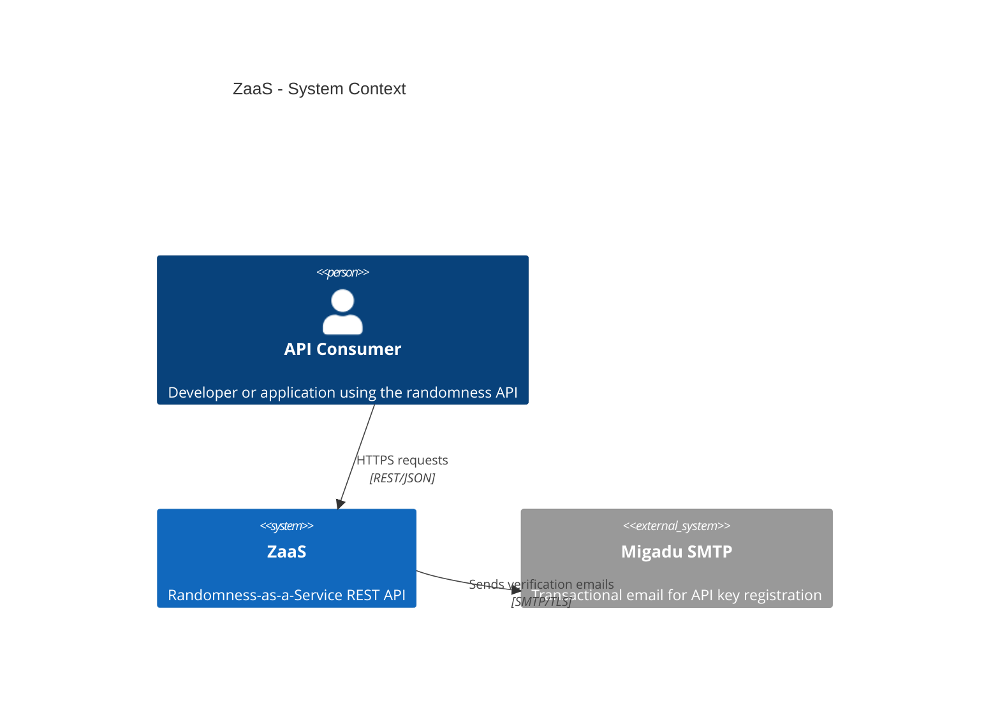
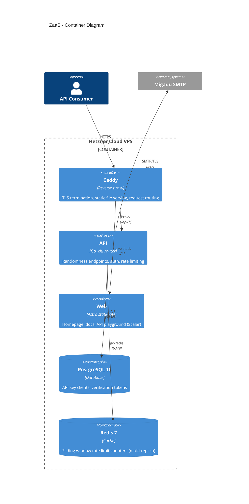

# Architecture Reference

> **Explanation:** For the reasoning behind these design choices, see [explanation/design-decisions.md](../explanation/design-decisions.md).

## System Overview (C4 Context + Container)





**Key architectural property:** All external infrastructure is optional. Without PostgreSQL, auth endpoints are disabled. Without Redis, rate limiting falls back to an in-memory backend. Without SMTP, registration emails cannot be sent. The core randomness endpoints always work with zero dependencies.

## Request Flow

```
Client -> Caddy (TLS/proxy) -> chi Router
  -> RequestID -> RealIP -> Logger -> CORS
  -> Auth middleware (extracts client from Bearer token via DB lookup)
  -> RateLimit middleware (per-client RPM if authenticated, per-IP if anonymous)
  -> oapi-codegen HandlerWrapper (query param parsing)
  -> Server handler method (e.g. RollDice)
  -> service.* pure function (business logic)
  -> respond helpers -> JSON response
```

## Package Layout

```
api/
├── cmd/server/          Entry point - wires config, telemetry, router, HTTP server
├── internal/
│   ├── gen/             Generated code (do not edit manually)
│   │   └── openapi.gen.go
│   ├── handler/         HTTP layer - Server struct, router, response helpers
│   │   ├── server.go    Implements gen.ServerInterface (randomness endpoints)
│   │   ├── auth.go      Auth endpoints (register, verify, reissue)
│   │   ├── router.go    Chi router with middleware + gen.HandlerFromMux
│   │   ├── respond.go   WriteSingle / WriteMultiple / WriteError helpers
│   │   ├── health.go    /healthz + /readyz
│   │   ├── metrics.go   Prometheus metrics endpoint
│   │   └── openapi.go   Serves embedded openapi.yaml
│   ├── service/         Business logic - pure functions, no HTTP concerns
│   │   ├── auth.go      Key generation + hashing
│   │   ├── coin.go      Coin flip
│   │   ├── color.go     Random color (hex, RGB, HSL, named)
│   │   ├── coordinates.go  Random lat/lng
│   │   ├── dice.go      Dice rolling
│   │   ├── lorem.go     Lorem ipsum generation
│   │   ├── number.go    Random number in range
│   │   ├── password.go  Password generation
│   │   ├── sshkey.go    SSH keypair generation
│   │   ├── uuid.go      UUID v4 generation
│   │   └── words.go     Random words (embedded wordlists)
│   ├── config/          Env-var configuration (ZAAS_* prefix)
│   ├── middleware/       Auth, CORS, logger, rate-limit, request-ID, context helpers
│   ├── ratelimiter/     RateLimiter interface + memory and Redis implementations
│   ├── store/           Repository interfaces + PostgreSQL implementations; goose migrations
│   ├── email/           Sender interface + Migadu SMTP implementation; HTML/text templates
│   └── telemetry/       OpenTelemetry setup (see observability.md)
└── oapi-codegen.yaml    oapi-codegen config (input for make generate)
```

The `service/` layer has no knowledge of HTTP or generated types. Handlers in `server.go` translate between the generated parameter types and the service function signatures.

## Code Generation

`docs/reference/openapi.yaml` is the single contractual source of truth for the API. [`oapi-codegen`](https://github.com/oapi-codegen/oapi-codegen) reads it and generates two things into `api/internal/gen/openapi.gen.go`:

- A `ServerInterface` - one method per spec endpoint, chi-flavored
- All model types - request parameter structs, response body structs, error types

`api/internal/handler/server.go` and `auth.go` contain the `Server` struct which implements `ServerInterface` by delegating to the service layer. A compile-time assertion (`var _ gen.ServerInterface = (*Server)(nil)`) ensures the struct stays in sync with the spec.

Route registration in `router.go` is a single call: `gen.HandlerFromMux(&Server{}, r)`. Adding, removing, or renaming an endpoint in the spec automatically propagates to the interface - the code will not compile until `Server` is updated.

```bash
make generate
```

This runs two steps:

1. `cp docs/reference/openapi.yaml api/internal/handler/openapi.yaml` - refreshes the embedded spec served at `/api/v1/openapi.yaml`
2. `cd api && go generate ./internal/gen/...` - runs `oapi-codegen` via the `//go:generate` directive in `api/internal/gen/gen.go`

The generated `openapi.gen.go` is committed to the repository. This means the build is reproducible without running `make generate`, and diffs to the generated file are visible in code review when the spec changes.

`api/internal/gen/tools.go` (build tag `//go:build tools`) pins the `oapi-codegen` binary as a Go module dependency so `go mod tidy` does not prune it.

## Rate Limiting

Rate limiting uses a **sliding window counter** algorithm, implemented in two backends selected via `ZAAS_RATE_LIMIT_BACKEND`:

- `memory` (default) - in-process, mutex-protected slice of timestamps per key
- `redis` - Lua script on Redis sorted sets for atomic check+increment; required for multi-replica deployments

Both backends satisfy the same interface:

```go
type RateLimiter interface {
    Allow(key string) (allowed bool, remaining int, resetAt time.Time, err error)
    AllowN(key string, rpm int) (allowed bool, remaining int, resetAt time.Time, err error)
}
```

The middleware logic per request:

1. If `Authorization: Bearer <key>` is present: hash the key, look up in the `clients` table. Valid key -> rate limit by client ID at the client's `rate_limit_rpm` (default 600). Invalid or revoked key -> HTTP 401 `INVALID_API_KEY` (not a silent fallback to IP limiting).
2. No key -> rate limit by IP at `ZAAS_RATE_LIMIT_RPM` (default 60 RPM).

Auth endpoints (`/api/v1/auth/*`) have tighter per-IP limits (5 req/hour for register/reissue, 20 req/hour for verify) applied by a separate middleware on the auth router group.

### IP extraction for anonymous rate limiting

The source of truth for the client IP is the **rightmost entry of the `X-Forwarded-For` header**, which is the hop appended by the trusted Caddy reverse proxy. A spoofed `X-Forwarded-For` value supplied by the client appears as an earlier (leftmost) entry and is therefore ignored. When `X-Forwarded-For` is absent (direct connections, local development) the host portion of `r.RemoteAddr` is used, parsed with `net.SplitHostPort` to correctly strip the port from both IPv4 (`1.2.3.4:1234`) and IPv6 (`[::1]:1234`) addresses.

This strategy is implemented in `api/internal/middleware/ratelimit.go:extractIP`. Any change to the Caddy proxy configuration that affects how `X-Forwarded-For` is appended must be reflected here.

## Auth and API Keys

Self-service free API key registration. No payment required.

**Key format:** `zaas_` prefix + 32 random lowercase hex characters (128 bits of entropy). Example: `zaas_a1b2c3d4e5f6a7b8c9d0e1f2a3b4c5d6`. The `zaas_` prefix makes keys grep-able in logs and identifiable if accidentally committed.

**Storage:** Keys are never stored in plaintext. Only the SHA-256 hash (`api_key_hash`) and the first 8 characters (`api_key_prefix`) are persisted. On every authenticated request the incoming key is hashed and looked up by hash.

**One key per email.** Re-registering an already-verified email triggers the re-issue flow, which atomically revokes the old key and issues a new one.

**Registration flow:**

1. `POST /api/v1/auth/register` with `{"email": "...", "display_name": "..."}` - always returns 202 (prevents email enumeration). Creates an unverified client row and a verification token (24h expiry), sends an email with the verification link.
2. `GET /api/v1/auth/verify?token=<token>&type=registration` - validates the token, generates the API key, stores its hash, marks the client verified. Returns the plaintext key once - it is never shown again.

**Re-issue flow:**

1. `POST /api/v1/auth/reissue` with `{"email": "..."}` - always returns 202. Sends a re-issue email if the email is known and verified.
2. `GET /api/v1/auth/verify?token=<token>&type=reissue` - revokes the old key, generates and stores a new one. Returns the new plaintext key.

**Revocation:** Soft-delete via `revoked_at` timestamp. Rows are never deleted, preserving audit trail.

## Database

PostgreSQL 16, accessed via `pgx/v5`. Migrations use [goose](https://github.com/pressly/goose) v3 with SQL files embedded in the binary via `embed.FS` (`api/internal/store/migrations/`).

**`clients` table** - one row per registered API key:

| Column | Type | Notes |
| ------ | ---- | ----- |
| `id` | `uuid` | PK, `gen_random_uuid()` |
| `email` | `text` | unique |
| `display_name` | `text` | shown in dashboards |
| `api_key_hash` | `text` | SHA-256 of full key |
| `api_key_prefix` | `text` | first 8 chars for identification |
| `rate_limit_rpm` | `int` | default 600; per-client override |
| `created_at` | `timestamptz` | |
| `verified_at` | `timestamptz` | NULL until email verified |
| `revoked_at` | `timestamptz` | NULL unless revoked (soft delete) |

Hot-path index: `clients(api_key_hash)` - looked up on every authenticated request.

**`verification_tokens` table** - short-lived tokens for registration and re-issue:

| Column | Type | Notes |
| ------ | ---- | ----- |
| `id` | `uuid` | PK |
| `email` | `text` | |
| `token_hash` | `text` | SHA-256 of token |
| `type` | `text` | `registration` or `reissue` |
| `expires_at` | `timestamptz` | 24h from creation |
| `used_at` | `timestamptz` | NULL until consumed |

**Backups:** GFS (Grandfather-Father-Son) rotation via `deploy/scripts/backup-postgres.sh` (cron on the host). Retains 7 daily, 4 weekly, 6 monthly backups in `/var/backups/zaas/`. See `docs/reference/runbook.md` for setup and SQL maintenance reference.

## Email

Transactional email via Migadu SMTP. Implementation in `api/internal/email/`:

- Transport: `net/smtp` stdlib (no external dependency), STARTTLS on port 587
- Templates: `html/template` + `text/template`, both variants sent as multipart MIME
- Templates embedded in the binary via `embed.FS`

```go
type Sender interface {
    SendVerification(ctx context.Context, to, verificationURL string) error
    SendReissue(ctx context.Context, to, verificationURL string) error
}
```

Configuration via `ZAAS_SMTP_*` env vars - see `.env.example` for all variables and comments. In local development (`make dev`) SMTP is overridden to Mailpit; no real emails are sent.

## Deployment

Single Hetzner Cloud VPS running Docker Compose. Components:

- **Caddy** - TLS termination (automatic Let's Encrypt), reverse proxy to API (`/api/*`), serves Astro static files for all other routes
- **API** - Go binary in a distroless container
- **Web** - Astro static site built at image build time, served by Caddy
- **PostgreSQL 16** - client/token storage, backups via GFS cron script
- **Redis 7** - rate limit state (optional, only needed for multi-replica)
- **Webhook** (almir/webhook) - listens for GitHub push events to trigger automated redeploy

Automated deploy: GitHub Actions builds and pushes the API image to GHCR on `main` push, then notifies the webhook endpoint which pulls the new image and restarts the service. See `docs/how-to/deploy.md` for setup details.
