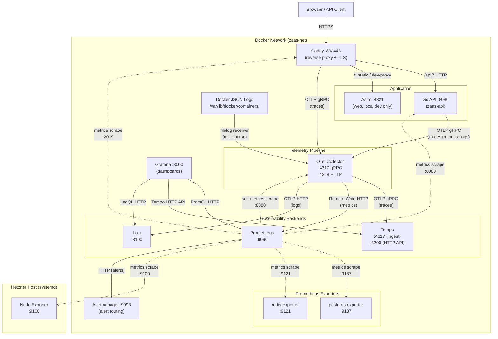

# Observability Reference

> **Concepts and rationale:** See [explanation/observability-concepts.md](../explanation/observability-concepts.md).
> **Migrating to a different backend:** See [explanation/migration-dynatrace.md](../explanation/migration-dynatrace.md).

## Tool Inventory

Pinned image versions are the source of truth in [`deploy/docker-compose.yaml`](../../deploy/docker-compose.yaml). The table below lists roles only; do not duplicate version numbers here.

| Tool | Signal(s) | Role |
| ---- | --------- | ---- |
| **OpenTelemetry Collector** | Traces, Metrics, Logs | Receives all telemetry from the API via OTLP, batches it, and fans it out to the appropriate backends. The single ingestion point - the application talks only to the Collector, never directly to backends. |
| **Tempo** | Traces | Distributed tracing backend. Receives OTLP traces from the OTel Collector. Provides TraceQL and integrates natively with Grafana. No standalone Tempo UI. |
| **Prometheus** | Metrics | Time-series metrics database. Receives metrics via remote-write from the OTel Collector. |
| **Loki** | Logs | Log aggregation system. Indexes labels only, stores log lines compressed. Queried via LogQL in Grafana. |
| **Grafana** | Traces, Metrics, Logs | Unified visualization and dashboarding layer. The primary observability UI. |
| **postgres-exporter** | Metrics | Exposes database-level metrics to Prometheus via scrape on `:9187`. |
| **redis-exporter** | Metrics | Exposes Redis INFO metrics to Prometheus via scrape on `:9121`. |
| **Node Exporter** | Metrics | Host-level metrics. Runs as a systemd service on the Hetzner host (not in Docker). Exposes CPU, memory, disk, network on `:9100`. See [runbook section 11](runbook.md#11-node-exporter-host-metrics) for installation. |
| **Alertmanager** | - | Alert routing and notification. Receives firing alerts from Prometheus, groups and deduplicates them, and delivers them to Slack via an Incoming Webhook. UI at `:9093`. |

## Architecture Diagram



> Dashed arrows = Prometheus scraping (pull). All other arrows = application or Collector pushing data. Node Exporter runs on the host outside Docker; Prometheus reaches it via `host.docker.internal:9100`.

## Communication: Protocols, Ports, and Direction

| From | To | Protocol | Direction | Port | Notes |
| ---- | -- | -------- | --------- | ---- | ----- |
| `zaas-api` | `otel-collector` | OTLP gRPC | Push | 4317 | All three signals over a single gRPC connection. SDK uses `OTEL_EXPORTER_OTLP_ENDPOINT`. |
| `otel-collector` | `tempo` | OTLP gRPC | Push | 4317 | Collector forwards traces. |
| `otel-collector` | `prometheus` | Prometheus Remote Write (HTTP POST) | Push | 9090 | Path: `/api/v1/write`. Enabled via `--web.enable-remote-write-receiver`. |
| `otel-collector` | `loki` | OTLP HTTP | Push | 3100 | Path: `/otlp`. Native OTLP ingestion added in Loki 3.x. |
| `prometheus` | `otel-collector` | HTTP GET (scrape) | Pull | 8888 | Collector self-monitoring metrics. |
| `prometheus` | `caddy` | HTTP GET (scrape) | Pull | 2019 | Caddy built-in metrics endpoint. |
| `caddy` | `otel-collector` | OTLP gRPC | Push | 4317 | Caddy sends request traces via `OTEL_EXPORTER_OTLP_ENDPOINT`. |
| `grafana` | `prometheus` | HTTP (PromQL) | Pull | 9090 | Dashboard panels and alerting. |
| `grafana` | `tempo` | HTTP (Tempo HTTP API) | Pull | 3200 | Trace data for Tempo datasource. |
| `grafana` | `loki` | HTTP (LogQL) | Pull | 3100 | Log panels and correlation. |
| `zaas-api` | _(self)_ | HTTP GET | Pull | 8080 | Optional `/metrics` endpoint (Prometheus exposition). Active when `ZAAS_METRICS_ENDPOINT_ENABLED=true`. |
| Docker JSON logs | `otel-collector` | File tail (filelog receiver) | Pull | - | Tails `/var/lib/docker/containers/*/*-json.log`. |
| `prometheus` | `postgres-exporter` | HTTP GET (scrape) | Pull | 9187 | PostgreSQL metrics. |
| `prometheus` | `redis-exporter` | HTTP GET (scrape) | Pull | 9121 | Redis INFO metrics. |
| `prometheus` | `node-exporter` | HTTP GET (scrape) | Pull | 9100 | Host metrics via `host.docker.internal:9100`. |
| `prometheus` | `alertmanager` | HTTP (alert push) | Push | 9093 | Prometheus sends firing alerts to Alertmanager for routing and deduplication. |

## OTel Collector Pipelines

```
OTLP gRPC/HTTP receiver --+
                           |
filelog/docker receiver ---+  (logs only)
                           v
                  batch processor (5s timeout, max 1000 items)
                           |
                  +--------+------------------------------------------+
                  | traces  --> otlp/tempo  (gRPC :4317)              |
                  | metrics --> prometheusremotewrite                  |
                  | logs    --> otlphttp/loki                          |
                  +---------------------------------------------------+
```

## Grafana Datasource Wiring

Grafana is pre-provisioned via `deploy/grafana/provisioning/` with all three datasources:

- **Prometheus** (default datasource, uid `prometheus`) - all metric panels in the ZaaS Overview dashboard.
- **Tempo** (uid `tempo`) - trace viewer, trace search, trace-to-logs correlation (links to Loki), trace-to-metrics correlation, service map, node graph.
- **Loki** (uid `loki`) - includes a derived field that auto-links `trace_id` values in log lines to the corresponding Tempo trace.

## Accessing the UIs

All UIs are on `localhost` when running the local stack (`make dev`).

| Service | URL | Auth | Primary Use |
| ------- | --- | ---- | ----------- |
| **Grafana** | `http://grafana.localhost` | Anonymous Admin (no login) | Unified dashboards, cross-signal correlation. Start here. |
| **Prometheus** | `http://localhost:9090` | None | Ad-hoc PromQL, metric exploration, target/scrape status. |
| **Loki** (no UI) | `http://localhost:3100` | None | Query via Grafana Explore (LogQL) or HTTP API. |
| **Tempo** (no UI) | `http://localhost:3200` | None | Query via Grafana Explore (Tempo datasource) or HTTP API. `/ready` confirms health. |
| **OTel Collector** (no UI) | `http://localhost:8888/metrics` | None | Collector self-monitoring metrics. |
| **Alertmanager** | `http://localhost:9093` | None | View firing alerts, manage silences, inspect routing. Notifications go to Slack - see [runbook section 13](runbook.md#13-slack-alert-notifications). |

> **Production:** Grafana is at `https://grafana.zaas.at` with username/password login. Anonymous access is disabled.

## Data Storage and Persistence

All observability backends use named Docker volumes defined in `deploy/docker-compose.yaml`. Data survives `docker compose restart` and `docker compose stop/start` but is tied to the host volume store - a `docker compose down -v` will remove it.

| Component | Volume | Mount path | Notes |
| --------- | ------ | ---------- | ----- |
| **Tempo** | `tempo_data` | `/var/tempo` | WAL and trace blocks. |
| **Prometheus** | `prometheus_data` | `/prometheus` | TSDB. Default retention: 15 days (Prometheus default). |
| **Loki** | `loki_data` | `/loki` | Chunks and TSDB index. |
| **Grafana** | `grafana_data` | `/var/lib/grafana` | SQLite database, provisioned dashboards and datasources are re-applied from `deploy/grafana/provisioning/` on every start. |
| **Alertmanager** | `alertmanager_data` | `/alertmanager` | Silence and notification state. |
| **OTel Collector** | - | - | Stateless. |

If volume data is lost, see [Observability Stack Bootstrap (data loss)](runbook.md#observability-stack-bootstrap-data-loss) in the runbook.

## Alert Routing and Delivery

Alert rules live in `deploy/prometheus.rules.yaml`; routing and delivery live in `deploy/alertmanager.yaml`. Every rule carries a `severity` label, and that label alone decides where the notification goes.

| `severity` | Receiver | Slack color | Repeat interval |
| ---------- | -------- | ----------- | --------------- |
| `critical` | `slack-critical` | red (green on resolve) | 1h |
| `warning`, plus anything unmatched | `slack-warning` | yellow (green on resolve) | 4h |
| `none` | `slack-watchdog` | green | 24h |

Routes are evaluated in order and the first match wins. Every message links to the firing alert's own `runbook_url` label, so the Slack title goes straight to its playbook section.

Delivery is a Slack Incoming Webhook. The URL is a secret, and because Alertmanager does not expand environment variables in its config it is read from a file (`global.slack_api_url_file`) mounted at `/etc/alertmanager/secrets/` from the gitignored `deploy/secrets/`. Setup is [runbook section 13](runbook.md#13-slack-alert-notifications).

`severity: none` is used by exactly one rule, `ZaasWatchdog`, which fires permanently by design. Its heartbeat is what makes a broken delivery path detectable: a missing secret file does not stop Alertmanager starting and produces no error, so *absence* of the daily message is the only available signal. See [ZaasWatchdog](runbook.md#zaas-watchdog).

## Node Exporter: Host Metrics

Node Exporter exposes host-level system metrics. It runs as a systemd service on the Hetzner host (not containerized) to avoid volume mount complexity for accurate host metrics.

| Collector | Key Metrics | Use |
| --------- | ----------- | --- |
| `cpu` | `node_cpu_seconds_total` | CPU saturation and breakdown |
| `meminfo` | `node_memory_MemAvailable_bytes` | Memory pressure |
| `filesystem` | `node_filesystem_avail_bytes` | Disk usage per mount |
| `netdev` | `node_network_receive_bytes_total` | Network I/O |
| `loadavg` | `node_load1`, `node_load5`, `node_load15` | System load |
| `stat` | `node_boot_time_seconds` | Uptime |
| `textfile` | `zaas_backup_*`, `node_textfile_scrape_error` | Backup freshness and outcome |

Node Exporter runs with `--collector.disable-defaults`, so each collector above is enabled explicitly. `textfile` needs two flags rather than one: `--collector.textfile` to enable it and `--collector.textfile.directory=/var/lib/node_exporter/textfile_collector` to point it at the drop directory.

### Backup metrics

`deploy/scripts/backup-metrics.sh` runs as `ExecStopPost=` on both backup units and writes one `.prom` file per backup job into the textfile directory. The `backup` label is either `postgres` or `volumes`.

| Metric | Type | Meaning |
| ------ | ---- | ------- |
| `zaas_backup_last_run_timestamp_seconds` | gauge | Unix time of the last run, successful or not |
| `zaas_backup_last_run_success` | gauge | 1 if the last run succeeded, 0 if it failed |
| `zaas_backup_last_success_timestamp_seconds` | gauge | Unix time of the last successful run |
| `zaas_backup_last_success_bytes` | gauge | Total bytes written by the last successful run |

The last two are carried forward across a failed run, so a failure never erases the record of the last good backup. They are absent entirely until the first success, which is what `ZaasBackupMetricsMissing` detects.

The label is `backup` rather than `job` because Prometheus's own scrape `job` label takes precedence and a `job` label in a textfile metric is silently renamed `exported_job`.

Useful PromQL queries:

```promql
# CPU usage % (all cores combined, 5m average)
100 - (avg by (instance) (rate(node_cpu_seconds_total{mode="idle"}[5m])) * 100)

# Memory used %
100 * (1 - (node_memory_MemAvailable_bytes / node_memory_MemTotal_bytes))

# Disk usage % for root filesystem
100 * (1 - (node_filesystem_avail_bytes{mountpoint="/"} / node_filesystem_size_bytes{mountpoint="/"}))

# Network receive rate (bytes/sec, eth0)
rate(node_network_receive_bytes_total{device="eth0"}[5m])

# System uptime
time() - node_boot_time_seconds

# Age of the last successful backup, per backup job
time() - zaas_backup_last_success_timestamp_seconds
```

Installation instructions: see [runbook section 11](runbook.md#11-node-exporter-host-metrics).

## Service Resource Attributes

Every trace, metric, and log record produced by the API carries the following OTel resource attributes, built in `api/internal/telemetry/telemetry.go`:

| Attribute | Source | Example |
| --------- | ------ | ------- |
| `service.name` | Hard-coded `"zaas-api"` | `zaas-api` |
| `service.version` | Build-time `-ldflags -X main.version=<tag>` | `v1.2.3` |
| `service.instance.id` | Random UUID generated at process start | `a3f1...` |
| `deployment.environment` | `ZAAS_ENVIRONMENT` env var (default: `development`) | `production` |

Set `ZAAS_ENVIRONMENT=production` in the production environment to distinguish environments in Tempo, Loki, and Grafana dashboards.

## Trace Sampling

The SDK is configured with `ParentBased(TraceIDRatioBased(ratio))`. The ratio is read from the `OTEL_TRACES_SAMPLER_ARG` environment variable at startup.

| Value | Behavior |
| ----- | -------- |
| `1.0` (default) | Sample every request. Suitable for low-traffic or development. |
| `0.1` | Sample 10% of new root spans. Recommended starting point for production. |
| `0.0` | Drop all new root spans (child spans still follow parent decision). |

A parent-based sampler means that if an incoming request already carries a sampled trace context (e.g. from Caddy), the API respects that decision rather than re-rolling. This ensures consistent trace completeness end-to-end.

Adjust `OTEL_TRACES_SAMPLER_ARG` in `deploy/docker-compose.yaml` before going to production to avoid filling Tempo storage.

## Span Instrumentation

The API produces spans at multiple layers. Every HTTP request automatically receives an `http.server` span from the `otelhttp` middleware. Additional spans are generated for key downstream calls:

| Layer | Span name / pattern | Library | Key attributes |
| ----- | ------------------- | ------- | -------------- |
| HTTP server | `<method> <route>` | `otelhttp` (auto) | `http.method`, `http.route`, `http.status_code` |
| PostgreSQL | `<db.operation> <table>` | `otelpgx` | `db.system=postgresql`, `db.statement` (param-scrubbed) |
| Redis | Redis command name (e.g. `EVAL`) | `redisotel` | `db.system=redis`, `net.peer.addr` |
| SMTP | `email.send` | Internal | `email.template`, `smtp.host` |

When a request flows through the auth registration or reissue path the Tempo trace will show:

```
http.server span (POST /api/v1/auth/register)
  db.query (INSERT clients)
  db.query (INSERT verification_tokens)
  email.send
    redis EVAL (rate-limit check)
```

## Glossary

| Term | Definition |
| ---- | ---------- |
| **OTLP** | OpenTelemetry Protocol. Wire format for telemetry data. Available as gRPC (binary) and HTTP/JSON. |
| **Span** | A single named, timed operation within a trace. Has start time, duration, status, and key-value attributes. |
| **Trace** | A collection of spans sharing the same `trace_id`, representing the full lifecycle of a request across services. |
| **Metric** | A numeric measurement recorded over time. Types: `Counter` (monotonically increasing), `Gauge` (current value), `Histogram` (distribution). |
| **Log Record** | A structured log event with timestamp, severity, message, and arbitrary key-value attributes. |
| **Resource** | Key-value attributes describing the entity producing telemetry (e.g., `service.name=zaas-api`). |
| **Instrumentation Scope** | Identifies the library or component that created a span/metric/log. |
